# MAWOS: Multi-Agent Workflow Orchestration System

*An agentic ERP for Indian engineering colleges. Repository: VidyaERP.*

[](LICENSE)
[](https://www.python.org/)
[](requirements.txt)
[](#tests)
[](#6-guardrails-the-part-that-makes-it-deployable)
[](NOTICE)

A working prototype of a **SMART, agentic ERP for an Indian engineering college** (autonomous /
VTU-affiliated model). The differentiator is not the CRUD. It is the **agent mesh** sitting on top
of the institutional database, which an administrator can *talk to* and *delegate work to*.

<p align="center">
  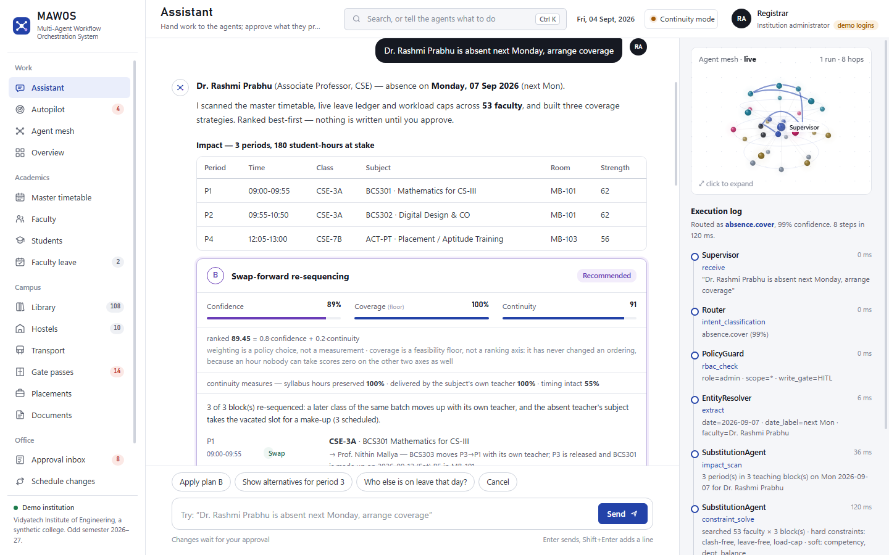
  <br><sub><i>“Dr. Rashmi Prabhu is absent next Monday, arrange coverage.” Three plans, every number measured, nothing written until the Registrar approves. Right: the live agent mesh and the execution log.</i></sub>
</p>

```bash
git clone https://github.com/samprith02/VidyaERP.git && cd VidyaERP
pip install -r requirements.txt
python3 -m uvicorn app:app --port 8000      # → http://localhost:8000  (sign in as registrar / registrar)
```

That is the whole setup. No database server, no migrations, no API key: `db.py` seeds a complete
synthetic institution into SQLite on first import, and the deterministic rule engine answers every
query offline. Add an LLM key later (§2) and the same guardrails apply to the model.

**Two dependencies**, FastAPI and Uvicorn. Everything else is the Python standard library, the
LLM client included, and the console is plain HTML with three local files (`static/mawos.css`,
`static/blocks.js`, `static/mesh.js`) that load no external scripts, styles or fonts.

> **All data here is synthetic.** "Vidyatech Institute", its 53 faculty, 1,095 students and their
> USNs, phone numbers and records are generated by `db.py`. No real institution or person is
> represented, and no third-party dataset is redistributed. See [NOTICE](NOTICE).

### At a glance

| | | | |
|:--|:--|:--|:--|
| **16** specialist agents | **59** tools · **20** writes, every one gated | **734** test assertions, 0 failing | **2** dependencies |
| **271** absences swept: the top plan fully covers **268** | **456 / 456** periods placed by the solver, 0 clashes | **91%** less tool payload per LLM turn | **0** external assets in the console |

Every number above is measured by [`docs/charts/make_charts.py`](docs/charts/make_charts.py) and
stored in [`docs/charts/results.json`](docs/charts/results.json). Re-run it and the charts in this
README redraw themselves from the code.

<details>
<summary><b>Contents</b></summary>

1. [The idea in one line](#1-the-idea-in-one-line)
2. [Two engines, one interface](#2-two-engines-one-interface)
3. [Agent architecture](#3-agent-architecture)
4. [Flagship flow: teacher absence → rescheduling](#4-flagship-flow--teacher-absence--timetable-rescheduling)
5. [What else the copilot handles](#5-what-else-the-copilot-handles): campus services, portals, the 3D mesh
6. [Guardrails](#6-guardrails-the-part-that-makes-it-deployable) and [MCP](#6a-driving-the-erp-from-claude-desktop-mcp)
7. [Data model and the timetable solver](#7-data-model-seeded-realistic)
8. [Files](#8-files) · [9. Interface](#9a-the-interface-staticmawoscss) · [11. Deploying](#11-deploying) · [12. License](#12-license)

</details>

---

## 1. The idea in one line

> The admin doesn't navigate the ERP. The admin states a problem, and a supervisor agent
> decomposes it, queries the right specialists, and comes back with **ranked, executable plans**
> that commit only on human approval.

<p align="center">
  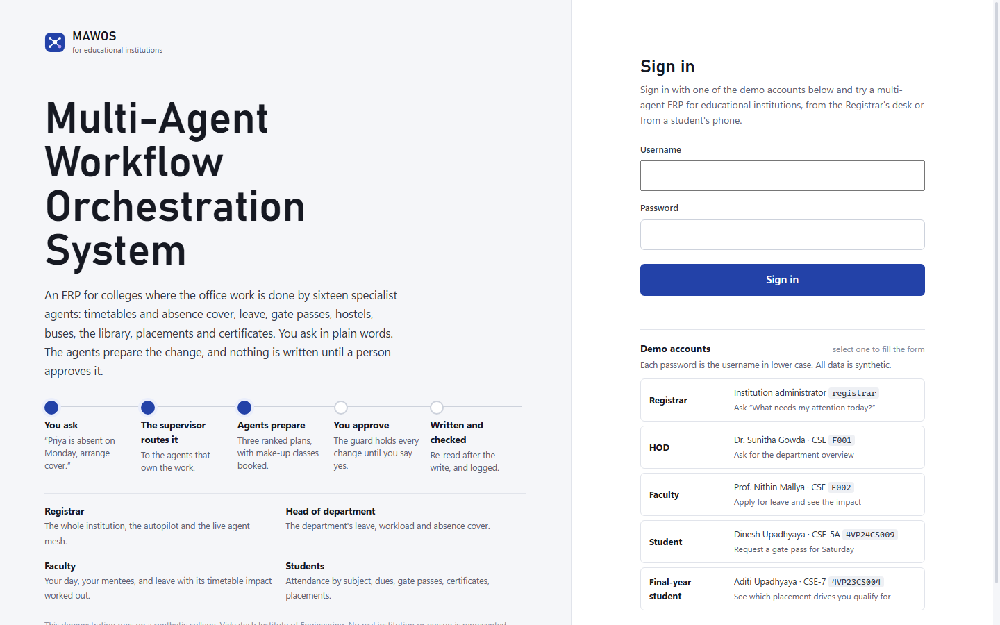
  <br><sub><i>The sign-in page states the contract: you ask → the supervisor routes → agents prepare → <b>you approve</b> → written and checked.</i></sub>
</p>

---

## 2. Two engines, one interface

| | Rule engine (default) | **LLM agent** (add a key) |
|---|---|---|
| Routing | keyword scoring + regex priority rules | the model plans and chooses tools |
| Answers | templated narrative | genuine prose, interprets the numbers |
| Multi-step | hard-coded flows | chains tools freely, up to 6 reasoning hops |
| Cost / latency | 0 ms, free | one API round-trip per hop |
| Guardrails | PolicyGuard + HITL | **identical**, enforced in code, outside the model |

The UI badge in the top bar shows which engine is live; click it to ping the endpoint.
Everything degrades gracefully: if the LLM is unreachable mid-turn, the rule engine answers
and says so.

### Enabling the LLM agent

```bash
cp .env.example .env      # already done
# edit .env:
LLM_API_KEY=gsk_...
LLM_BASE_URL=https://api.groq.com/openai/v1     # any OpenAI-compatible endpoint
LLM_MODEL=openai/gpt-oss-120b
```

Presets for OpenAI, Groq, OpenRouter, Together, DeepSeek, Gemini-compat and local Ollama are
listed in `.env.example`. No SDK is installed: `llm.py` talks raw HTTP over `urllib`, so there
is nothing to `pip install`. Restart the server and the badge flips to green.

<p align="center">
  
</p>

**The 59 tools the model can call** (a student, teacher or HOD is offered only their role's). 23 academic/admin:
`institution_overview · get_timetable · faculty_timetable · find_free_faculty · find_free_rooms ·
faculty_profile · faculty_workload · student_lookup · attendance_defaulters · fee_summary ·
exam_schedule · exam_eligibility · list_requests · list_leaves · plan_absence_coverage ·
apply_coverage_plan · plan_timetable_generation · apply_timetable_generation · undo_last_change ·
makeup_schedule · decide_request · create_request · broadcast_notice`. 25 campus services (§5a):
`ops_radar · student_360 · library_overview · library_search · library_overdue · issue_book ·
return_book · library_remind_overdue · hostel_status · hostel_complaints · allocate_hostel_room ·
dispatch_hostel_complaints · transport_status · rebalance_bus_routes · handle_bus_breakdown ·
gate_pass_queue · decide_gate_passes · placement_overview · drive_eligibility ·
publish_drive_shortlist · no_dues_status · issue_certificate · certificate_register ·
review_pending_leaves · decide_leave`. 9 self-service (§5c): `my_home · my_requests · my_placement ·
request_gate_pass · request_certificate · my_mentees · my_leaves · apply_leave · dept_overview`. And 2
for standing faculty availability: `faculty_availability · set_faculty_availability`.
**20 of the 59 are writes, and every one is gated.**

**Write-guard, proven by test:** `tests/mock_llm.py` includes a *rogue agent* endpoint that tries
to call `apply_coverage_plan` with no admin approval. PolicyGuard returns `{"BLOCKED": ...}`,
the database is untouched, and the model is told why. The same call succeeds the moment the
admin's message contains an approval. The model cannot talk its way past this: the check is in
`tools.py`, not in the prompt.

---

### Running against a metered API (why it stays up)

Free tiers are stingy. Groq allows **8,000 tokens/minute per model**, and an early
multi-hop turn was spending 7,196 of them. Four things fixed that:

| Technique | Effect |
|---|---|
| **Tool router**: the rule-engine NLU pre-selects 3–8 of the 59 tools per utterance | tool-schema payload **−91%** on the 40 example requests below, and the model picks better from a short menu |
| **Prompt diet**: live-context preamble trimmed, history 8→4 turns, tool results capped at 2.8 KB | system prompt ~1,500 → ~600 tokens |
| **Model failover chain**: `LLM_FALLBACK_MODELS`, tried in order on 429/5xx/`tool_use_failed` | quotas are *per model*, so the chain multiplies usable throughput |
| **Nullable optional params**: every non-required arg accepts `null` | models emit `{"dept": null}` constantly; strict validators 400 on it. 41 params were latent landmines |

<p align="center">
  
</p>

Result: a typical turn now costs **~2,000 tokens and answers in ~1.2 s**, and the
console survives a rate limit twice over: first by hopping to another model, and only
if the whole chain is exhausted by falling back to the rule engine with an honest notice.
The trace shows exactly which of these happened:

```
· ToolRouter    narrow_toolset    7 of 59 tools offered: plan_absence_coverage, …
· LLM Planner   reason (hop 1)    openai/gpt-oss-120b · 1032→107 tok · 513ms
· LLM Planner   model_failover    primary rate-limited → answered on qwen/qwen3.8-27b
```

### Tests

<p align="center">
  
</p>

```bash
python3 tests/solver_test.py  # timetable solver: 44 assertions, no server, no API cost
python3 tests/mcp_parity.py   # MCP guard parity: 263 assertions, no server, no API cost
python3 tests/campus_test.py  # campus services: 122 assertions, no server, no API cost
python3 tests/mesh_test.py    # the agent mesh's fault channel and approval stamp: 25 assertions, no server, no API cost
python3 tests/auth_test.py    # logins, route gating, per-role policy: 77 assertions, no server, no API cost
python3 tests/makeup_test.py  # booked make-ups, never double-booked; commits verified by re-read: 30 assertions, no server, no API cost
python3 tests/academics_test.py # standing faculty availability, honoured by every planner: 24 assertions, no server, no API cost
python3 tests/ranking_test.py # coverage-plan ranking: 57 assertions, no server, no API cost
python3 tests/deploy_test.py  # deployment readiness: 68 assertions, no server, no API cost
python3 tests/nlu_test.py     # date resolution, ISO dates included: 24 assertions, no server, no API cost
python3 tests/smoke.py        # deterministic rule-engine regression (needs the server, no API cost)
python3 tests/live_llm.py     # 6 real-model queries: engine, latency, tokens, table leaks
python3 docs/charts/make_charts.py --tests   # re-measure everything and redraw this README's charts
```

---

## 3. Agent architecture

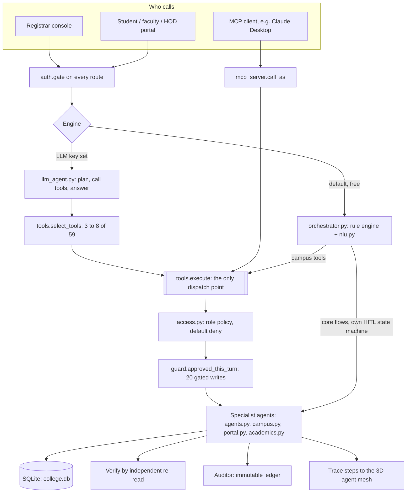
```mermaid
flowchart TB
  subgraph callers [Who calls]
    RC[Registrar console]
    PT[Student / faculty / HOD portal]
    MC[MCP client, e.g. Claude Desktop]
  end
  RC --> AG[auth.gate on every route]
  PT --> AG
  AG --> EN{Engine}
  EN -->|default, free| RE[orchestrator.py: rule engine + nlu.py]
  EN -->|LLM key set| LA[llm_agent.py: plan, call tools, answer]
  LA --> TR[tools.select_tools: 3 to 8 of 59]
  MC --> CA[mcp_server.call_as]
  TR --> EX[[tools.execute: the only dispatch point]]
  CA --> EX
  RE -->|campus tools| EX
  EX --> AC[access.py: role policy, default deny]
  AC --> GD[guard.approved_this_turn: 20 gated writes]
  GD --> SP[Specialist agents: agents.py, campus.py, portal.py, academics.py]
  RE -->|core flows, own HITL state machine| SP
  SP --> DB[(SQLite: college.db)]
  SP --> VR[Verify by independent re-read]
  SP --> AU[Auditor: immutable ledger]
  SP --> TC[Trace steps to the 3D agent mesh]
```

**Two engines, one gate.** The LLM agent and MCP both arrive at `tools.execute`, so they cannot
differ; `tests/mcp_parity.py` proves it. The rule engine drives the core specialists through its
own HITL state machine, and hands campus work to `tools.execute` like everyone else.

| Layer | Agents |
|---|---|
| Supervisor and routing | Supervisor · Router · ToolRouter · EntityResolver · LLM Planner |
| Guard and audit | **PolicyGuard** (RBAC, scope, ₹ ceilings, HITL gate, *outside* the model) · Auditor |
| Academic | SubstitutionAgent · TimetableAgent · FacultyAgent · PlanRanker · WorkloadBalancer · HRAgent |
| Students and finance | StudentAgent · AttendanceAgent · FinanceAgent · ExamAgent · RiskAgent |
| Campus services | LibraryAgent · HostelAgent · TransportAgent · GatePassAgent · PlacementAgent · DocumentAgent · OpsRadar |
| Operations | RequestAgent · NotifyAgent · AnalyticsAgent · SLAMonitor |

Support agents fire situationally: **WorkloadBalancer** (fairness), **RiskAgent** (severity
bucketing), **SLAMonitor** (approval ageing), **HRAgent** (leave ledger).

---

## 4. Flagship flow: teacher absence → timetable rescheduling

Say: *“Dr. Rashmi Prabhu is absent next Monday, arrange coverage.”*

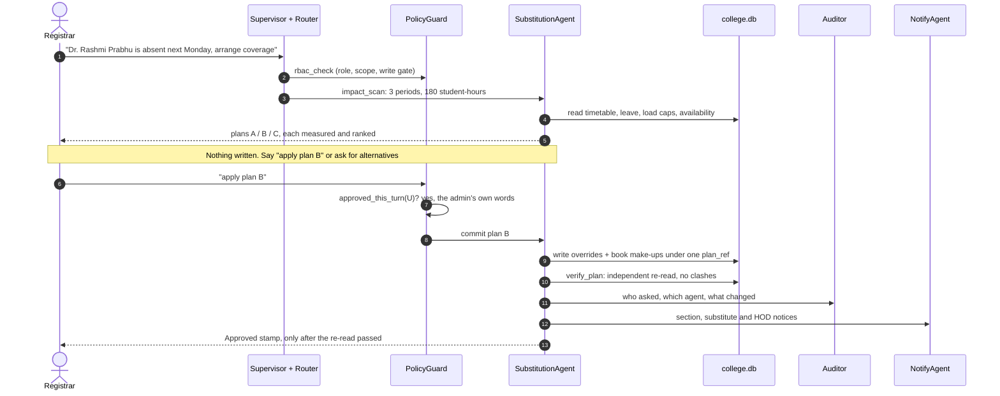
```mermaid
sequenceDiagram
  autonumber
  actor A as Registrar
  participant S as Supervisor + Router
  participant G as PolicyGuard
  participant SA as SubstitutionAgent
  participant DB as college.db
  participant AU as Auditor
  participant N as NotifyAgent
  A->>S: "Dr. Rashmi Prabhu is absent next Monday, arrange coverage"
  S->>G: rbac_check (role, scope, write gate)
  S->>SA: impact_scan: 3 periods, 180 student-hours
  SA->>DB: read timetable, leave, load caps, availability
  SA-->>A: plans A / B / C, each measured and ranked
  Note over A,SA: Nothing written. Say "apply plan B" or ask for alternatives
  A->>G: "apply plan B"
  G->>G: approved_this_turn(U)? yes, the admin's own words
  G->>SA: commit plan B
  SA->>DB: write overrides + book make-ups under one plan_ref
  SA->>DB: verify_plan: independent re-read, no clashes
  SA->>AU: who asked, which agent, what changed
  SA->>N: section, substitute and HOD notices
  SA-->>A: Approved stamp, only after the re-read passed
```

1. **Impact scan**: every period that faculty holds on that weekday, with student-hours at stake.
2. **Constraint solve**: for each vacant slot the SubstitutionAgent searches all faculty against:
   - **Hard constraints:** no clash in that period, not on approved leave, within load cap +2,
     lab sessions need lab competency, not inside a standing unavailability window.
   - **Soft scoring:** already teaches the same subject to another section (+46), subject in
     expertise profile (+24), same department (+14), free head-room (up to +16), fairness penalty
     for a second adjustment the same day (−9), professors de-prioritised for adjustments (−4).
3. **Three strategies generated, then re-ranked** by `0.8·confidence + 0.2·continuity`:

   | Plan | Strategy | Best when |
   |------|----------|-----------|
   | **A** | Competency-matched substitution | students' timetable must not change |
   | **B** | Swap-forward re-sequencing: a later class of the same batch moves up with its own teacher; the absent teacher's subject takes the vacated slot and is made up | the hour is better spent on a subject whose teacher is present |
   | **C** | Release + guaranteed make-up in the earliest mutually-free slot | no qualified substitute free |

   **Every one of those numbers is measured from the instance, and the weights are not.** That
   distinction is the point, so the console prints both on each card.

   | Axis | What is actually counted |
   |---|---|
   | **Coverage** | fraction of affected subject-hours with a concrete arrangement. A **feasibility floor, not a ranking axis** (see below) |
   | **Confidence** | the deliverer's score from the *same* candidate-scoring lens for all three plans (`score_deliverer` → `score_faculty`), so B and C are comparable with A rather than formulas parked beside it |
   | **Continuity** | `0.45·hours preserved + 0.35·delivered by the subject's own teacher + 0.20·timing intact`, where timing decays as `1/(1+slip_days)`: one curve for a within-day move and for a make-up next week |

   `0.8 / 0.2` and the continuity sub-weights are **policy coefficients, not findings**: a college
   that never wants a class released would raise continuity. They are declared once in
   `agents.RANK_WEIGHTS`, printed on every plan card, and `tests/ranking_test.py` asserts the rank
   shown is the rank used to sort, including a **documented tie-break** (rank, then continuity,
   then coverage, then plan code), so an order an administrator acts on never depends on dict
   insertion order.

   **Coverage carries 0 of the ranking weight, because it was being counted twice.**
   `coverage = mean(hours)` and `continuity = 100·(0.45·hours + 0.35·teacher + 0.20·timing)`:
   coverage *is* the hours term, and continuity already contains 45% of it. The old formula
   weighted hours at `0.25 + 0.15×0.45 = 0.3175` while presenting the two as separate axes worth
   0.25 and 0.15. It is still measured and still shown, as the **incomplete** flag: a plan that
   cannot arrange every hour must look incomplete whatever it scores.

   **Two plans that would commit the same rows are one option.** When no period can be
   re-sequenced, Plan B falls back to substitution and picks the same candidates as Plan A.
   Measured: 90 of 271 absences, a third of them, produced two byte-identical cards at an exact
   rank tie, which made "recommended" arbitrary. They are folded by *committed effect*
   (`commit_signature`), and the surviving card names what it subsumed. Applying by the folded
   letter still works.

4. **Human-in-the-loop**: nothing is written. The admin says *“apply plan B”* (bound by **plan code**,
   not list position).
5. **Commit**: timetable overrides written, leave ledger updated, notifications drafted and
   dispatched to each affected section, each substitute, and the HOD/Principal digest, audit row
   recorded. The published timetable grid shows overridden cells in amber.
6. **Verified, not trusted**: `SubstitutionAgent.verify_plan` re-reads the committed rows by
   `plan_ref` and checks the resulting state (no substitute teaching two places, no make-up sharing
   a room, teacher or batch) before the reply says it worked. The Auditor's `verify` step carries an
   explicit status, so a failure blinks red in the mesh.
7. **Make-ups are booked, not just promised**: plans B and C hold a dated make-up session with a
   room for every deferred hour (a missed 3-period lab gets 3 consecutive periods, on Saturday
   afternoon when no batch is timetabled). Booked hours are occupied for every later plan, and each
   booking is re-checked at apply time against the weekly timetable and every other booking. They
   appear on the class timetable for that week and in each student's and teacher's day.
8. **Rollback**: *“undo”* reverts the whole plan by its reference id and releases its make-ups.

<table>
<tr>
<td width="50%"></td>
<td width="50%">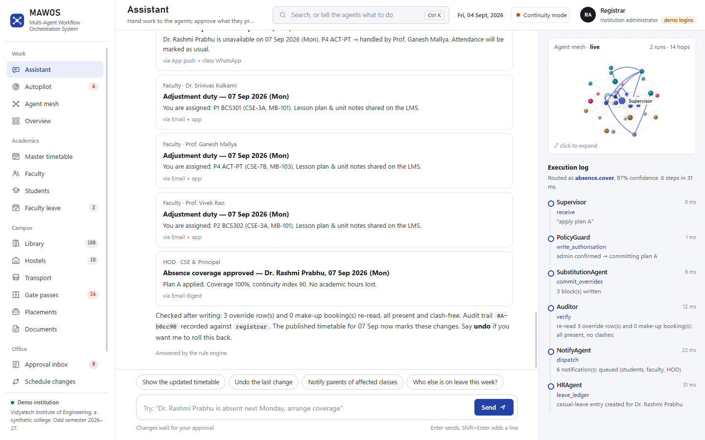</td>
</tr>
<tr>
<td><sub><b>Propose.</b> Each card shows the rank, the formula that produced it and the three measured continuity components.</sub></td>
<td><sub><b>Commit, then check.</b> Notices go out, and the reply reports the independent re-read. The log shows PolicyGuard's <code>write_authorisation</code>, then the Auditor's <code>verify</code>.</sub></td>
</tr>
</table>

### The ranking, measured across every absence the timetable can produce

Each of the 53 teachers made absent on each teaching day of one week gives **271 absences**
(24.8 ms each to plan). The recommendation is spread across all three strategies. None of them is
a default that wins by construction:

<p align="center">
  
</p>

<p align="center">
  
</p>

<p align="center">
  
</p>

The low tail is honest. It is the partial-scarcity case (a teacher whose block cannot be fully
arranged), and those cards are flagged **incomplete** on the page rather than ranked quietly.

<details>
<summary>Chart data (table view)</summary>

| Measurement | Value |
|---|---|
| Absences swept | 271 (53 faculty × Sat 05 – Fri 11 Sep 2026, days with classes) |
| Recommended plan | A 77 · B 76 · C 118 |
| Plan B folded into plan A (identical committed rows) | 90 |
| Top plan covers every hour | 268 of 271 |
| Rank of the recommended plan | min 48.5 · median 94.7 · max 98.95 |
| Planning time | 24.8 ms per absence |

</details>

---

## 5. What else the copilot handles

| Domain | Example utterance |
|---|---|
| Availability | “Which ECE faculty are free on Monday period 4?” · “Free rooms at period 6” |
| Timetable | “Show CSE 5th sem A timetable” · “Who is teaching at period 3?” |
| Faculty | “Faculty workload above 90%” · “Who teaches Machine Learning?” |
| Students | “Attendance defaulters below 65% in CSE sem 5” · “Student 4VP24CS017 details” · risk radar |
| Finance | “Fee dues by department” |
| Exams | “SEE eligibility check for MECH” · “Draft invigilation roster” |
| Approvals | “Pending approvals” · “Approve 3” · “Bulk approve under ₹50,000” · “Raise a purchase request to the Principal for ₹3 lakh, urgent” |
| Broadcast | “Notify all CSE students that lab exams are postponed to 15 Sep” |
| Analytics | “Brief me on today's institution status” |
| Leave | “Who is on leave this week?” |

**Conversation quality built in:** multi-turn pending state, context switching (a fresh command mid-proposal
does *not* get swallowed as a “yes”), disambiguation when a faculty name is a weak match
(“did you mean…” with match %), and contextual follow-ups (“show me the updated timetable” opens the
class that was actually changed, on the date that was changed).

<p align="center">
  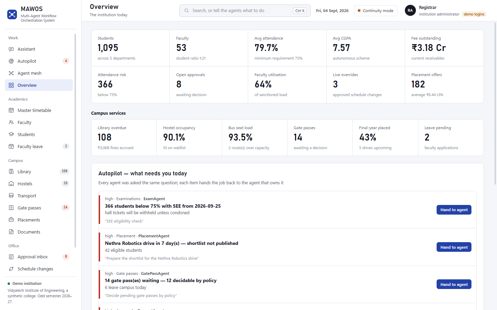
  <br><sub><i>Overview: the institution today, and the Autopilot queue of what needs a human.</i></sub>
</p>

### 5a. Campus services: the paperwork agents (`campus.py`)

Most of a college office's day is not the timetable. Seven more specialists own those ledgers,
each behind the same gate: called without the admin's approval, a write tool **computes the
change, stages it and writes nothing**; the same call commits once the admin says yes, and the
agent then **re-reads what it wrote** before claiming success.

| Agent | What it does on its own | Example |
|---|---|---|
| **OpsRadar** (Autopilot) | asks every agent what needs a human today; returns one ranked queue, each item carrying the sentence that hands it back | “What needs my attention today?” |
| **LibraryAgent** | catalogue search; issue/return under circulation rules (copy on shelf, 4-book student limit, no overdue books); fines at ₹2/day; one personalised reminder per overdue borrower | “Issue BK0012 to 4VP24CS017” · “Send overdue library reminders” |
| **HostelAgent** | occupancy by block; allots the waitlist by gender → batch-mates → branch-mates → part-filled rooms; routes complaints to the right crew with an SLA | “Allocate hostel rooms to the waitlist” |
| **TransportAgent** | seat load per route; moves riders off over-full buses **only at stops another route also serves**, never past that route's seats; breakdown cover with a spare bus | “Rebalance bus routes” · “Bus on route 4 broke down” |
| **GatePassAgent** | screens every pass against written policy (approve / reject / *review* with the reason), so the warden decides only the arguable ones | “Decide pending gate passes by policy” |
| **PlacementAgent** | drive eligibility: CGPA, backlogs, branch and a one-offer rule (a placed student may only sit a *dream* drive paying ≥1.5× their offer); publishes shortlists | “Who is eligible for the Nethra Robotics drive?” |
| **DocumentAgent** | no-dues across four ledgers (accounts, library, hostel, transport); certificates with register serials. A transfer certificate is refused while any due exists; closes the matching inbox request | “Issue a bonafide certificate for 4VP24CS017 for passport” |
| **HRAgent** | prices each pending leave by **running the substitution planner for every day it spans**; bulk-approves only the fully coverable ones | “Review pending leave applications” |
| **Student 360** | one student across every ledger, with subject-wise attendance | “Everything about 4VP24CS017” |

The gate-pass policy, stated once: emergencies and medical passes clear on policy; an outing must
be outside class hours (per the student's own semester day length) and back by 20:00; a class-hour
outing needs 85% attendance just to be reviewable; a home visit that misses class days needs 75%
and at most two days; no parent consent means the warden calls first. `tests/campus_test.py` pins
each of these as a case.

<table>
<tr>
<td width="50%">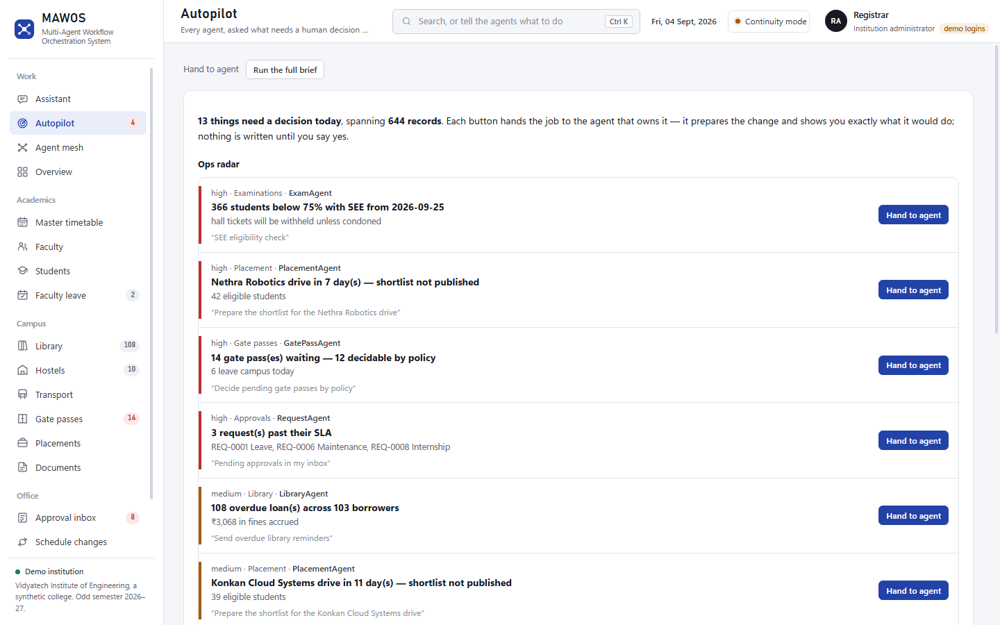</td>
<td width="50%">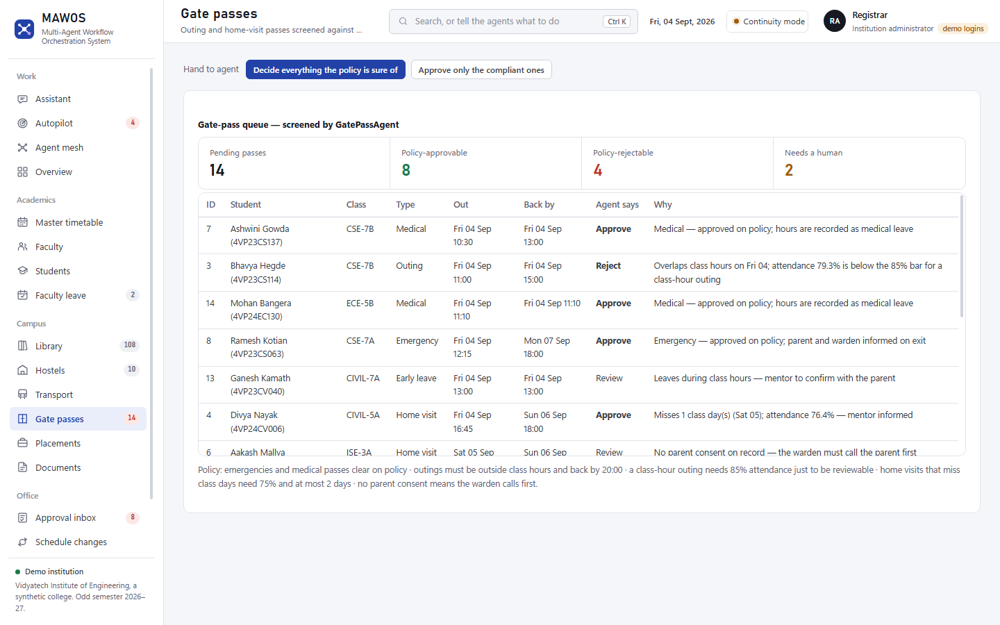</td>
</tr>
<tr>
<td><sub><b>Autopilot.</b> Every agent asked the same question. Buttons hand the job back; none of their sentences contains an approval word.</sub></td>
<td><sub><b>Gate passes.</b> GatePassAgent's verdict and reason for every pass, so the warden decides only the arguable ones.</sub></td>
</tr>
<tr>
<td>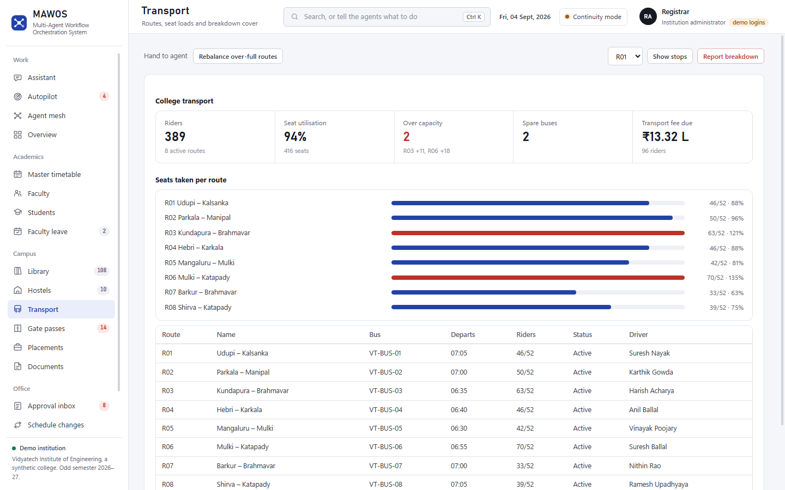</td>
<td>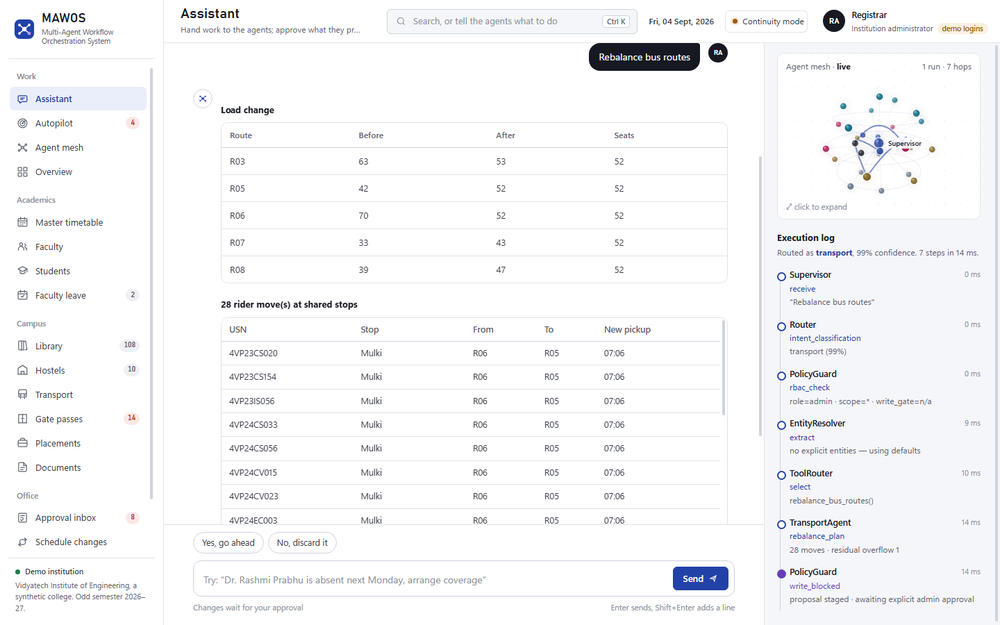</td>
</tr>
<tr>
<td><sub><b>Transport.</b> Two routes over capacity.</sub></td>
<td><sub><b>A held write.</b> “Rebalance bus routes” computes 28 moves at shared stops and <i>stages</i> them. The violet PolicyGuard step is the guard working, not a fault.</sub></td>
</tr>
<tr>
<td>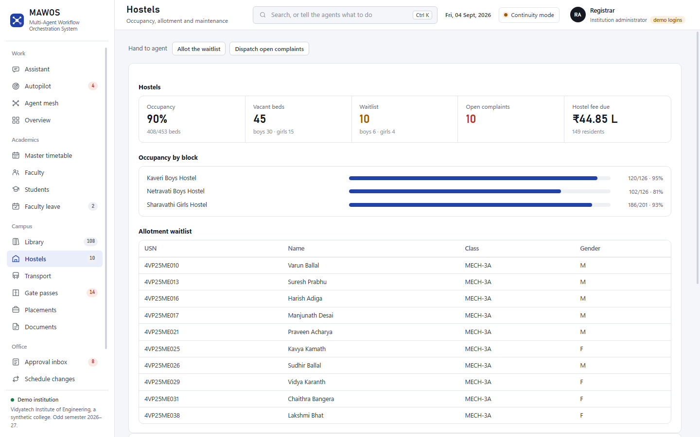</td>
<td>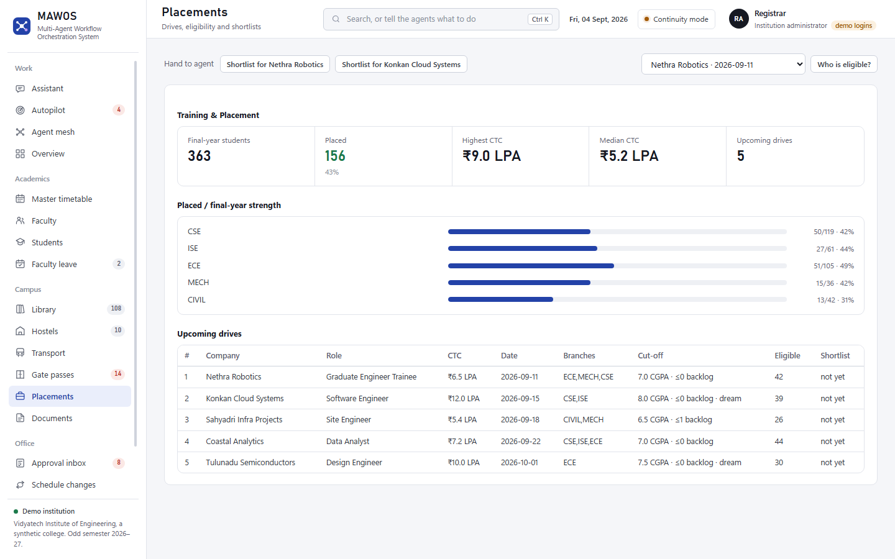</td>
</tr>
<tr>
<td>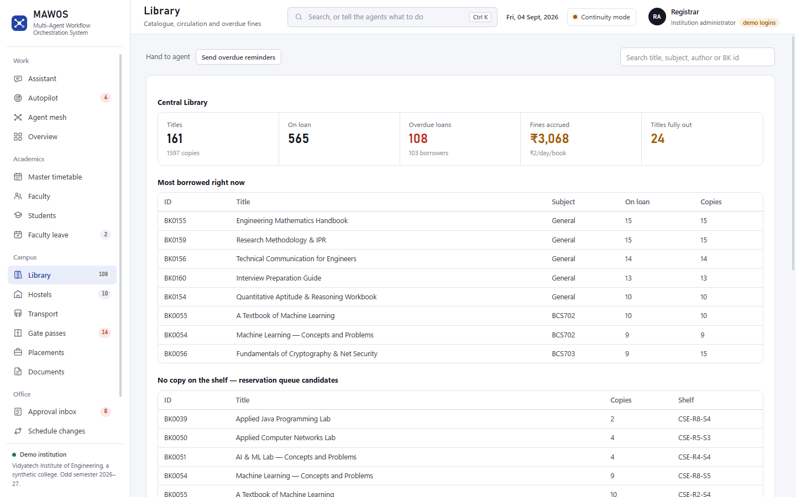</td>
<td>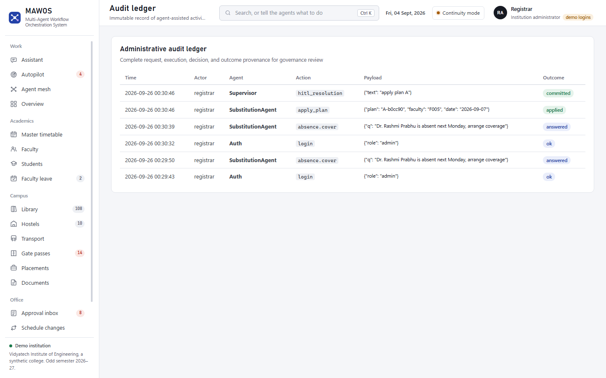</td>
</tr>
</table>

Every module has its own page in the console (Autopilot, Faculty Leave, Library, Hostels,
Transport, Gate Passes, Placements, Documents). Those pages render what the owning agent's
**read** tools return via `/api/panel/{tool}`, which lists reads only and passes an empty turn,
so a page can never commit anything; its buttons hand the job to the agent in the chat.

### 5c. Everyone signs in: students, faculty and HODs get their own portal

`/login` → the Registrar lands on the console; everyone else on a mobile-first portal with their
own day on one side and the assistant on the other. **Each sees only what their role allows**, and
that is decided per tool call in `tools.execute` (`access.py`), not in the UI or the prompt:

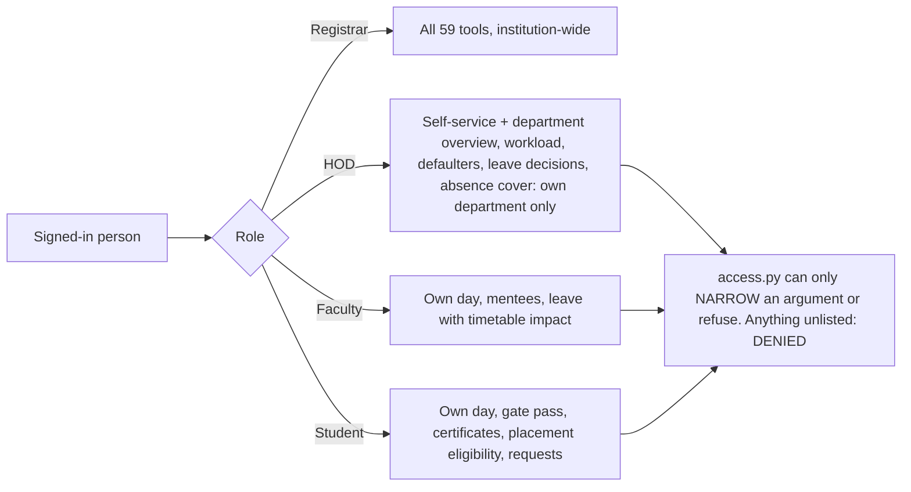
```mermaid
flowchart LR
  U[Signed-in person] --> R{Role}
  R -->|Registrar| ALL[All 59 tools, institution-wide]
  R -->|HOD| H[Self-service + department overview, workload, defaulters, leave decisions, absence cover: own department only]
  R -->|Faculty| F[Own day, mentees, leave with timetable impact]
  R -->|Student| S[Own day, gate pass, certificates, placement eligibility, requests]
  H & F & S --> N[access.py can only NARROW an argument or refuse. Anything unlisted: DENIED]
```

| Role | Their day | They can ask the agents to… |
|---|---|---|
| **Student** | today's classes, attendance by subject, dues, library books, next exam | file a **gate pass** (pre-screened by GatePassAgent), request a **certificate** (eligibility pre-checked by DocumentAgent), see placement eligibility, track requests |
| **Faculty** | today's classes, load, mentees who need a conversation | **apply for leave with the timetable impact attached** (HRAgent runs the substitution planner for each day), see mentees and their own leave |
| **HOD** | the above, plus the department's leave queue | department overview, workload and defaulters (their department only), **decide their department's leave**, plan absence cover for their own staff |

<table>
<tr>
<td width="24%" valign="top">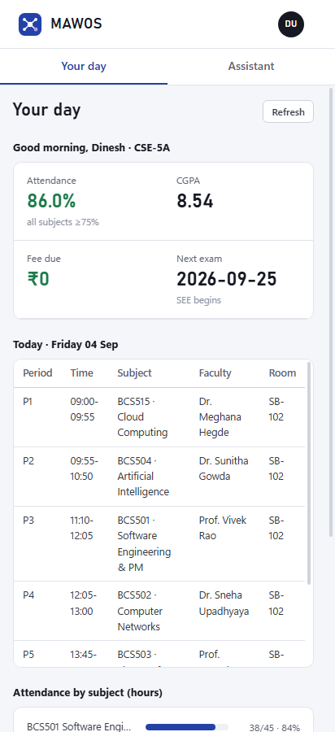</td>
<td width="24%" valign="top">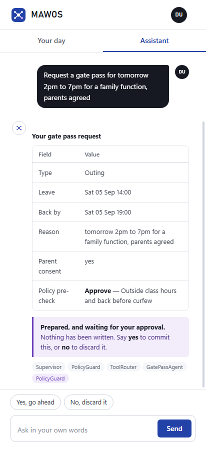</td>
<td width="52%" valign="top">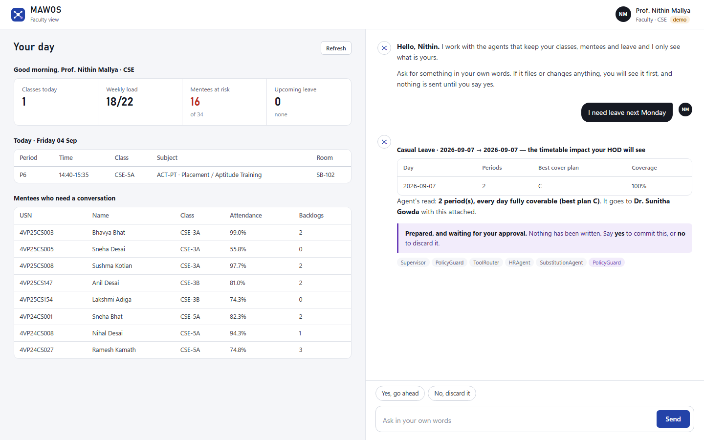</td>
</tr>
<tr>
<td><sub>A student's day, on a phone.</sub></td>
<td><sub>A gate pass, pre-screened by policy, filed only on the next “yes”.</sub></td>
<td><sub>A teacher's leave request arrives with its timetable impact already worked out for the HOD.</sub></td>
</tr>
</table>

Nothing a person files goes in until they confirm it in a *later* message. Asking to "apply for
leave" shows the impact first; the next "yes" files it. A student asking a Registrar question gets
a polite refusal, not someone else's data; `tests/auth_test.py` checks that no other student's USN
appears in any answer to a student.

### 5b. The agent mesh, in 3D

The chat's right rail and the **Agent mesh** page draw every agent in 3D, in light mode, and replay each
request's execution trace as packets travelling between them. Click the small mesh to open it full
screen. It is a hand-rolled perspective projection on a plain `<canvas>` (`static/mesh.js`), with no
three.js and no CDN, because the console must keep loading nothing external.

<table>
<tr>
<td width="50%">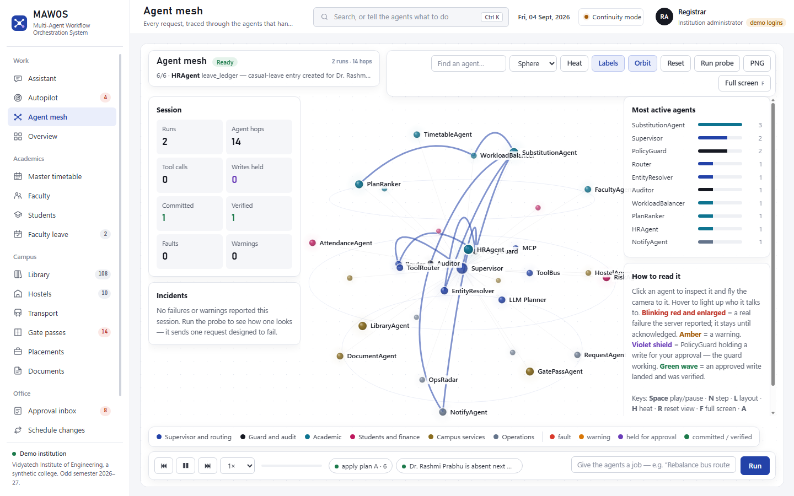</td>
<td width="50%">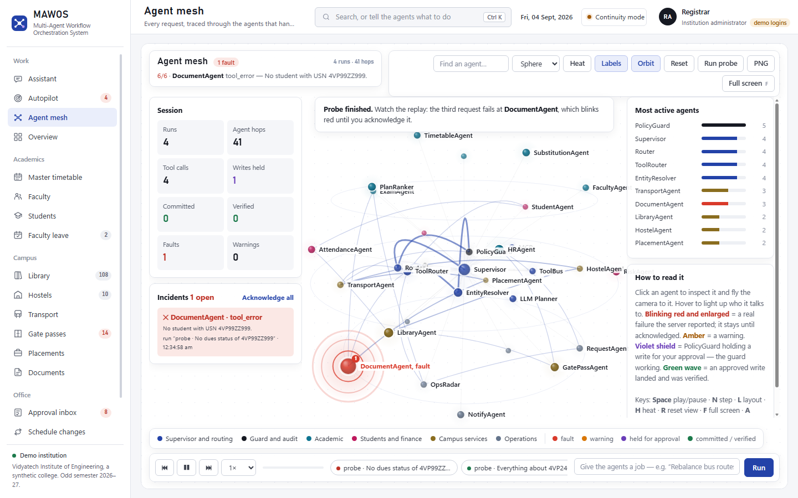</td>
</tr>
<tr>
<td><sub><b>A clean run.</b> The approved plan: committed 1, verified 1, faults 0.</sub></td>
<td><sub><b>A real fault.</b> <i>Run probe</i> asks for a student who does not exist. DocumentAgent, the agent that owns the tool, blinks red until acknowledged.</sub></td>
</tr>
</table>

**It shows failures truthfully.** An agent blinks red, grows and carries a fault badge only where
the **server** reported `status: "error"`: a failed tool call (pinned on the agent that owns the
tool, not the bus that carried it), a failed post-write verification, an unreachable model. It
stays red until acknowledged, and every fault is listed under *Incidents*. Warnings are amber. A
write held by PolicyGuard gets a violet shield (that is the guard working, not a fault), and an
approved write that lands and verifies sends a green shockwave. `tests/mesh_test.py` holds this
down: failures are always reported, always on their owner, holds never count, and the graph knows
every agent the server can name.

**Interactive:** click an agent to fly the camera to it and open an inspector (role, health,
activations, average step time, who it talks to, recent actions, and a button that asks it
something); hover to light up its neighbours; search; hide groups from the legend; four layouts
(sphere, rings, flow, clusters) with animated transitions; heat mode (size and colour by activity);
orbit, pan (shift/right-drag), zoom, double-click to reset. **Playback:** a timeline of every run
(click one to replay it) with play/pause, single step and ¼×–4× speed, and a caption naming each
step as it lands. Statistics are counted once, when a trace arrives, so replays never double-count.
**Run probe** sends three real read-only requests on the free rule engine, the last deliberately
asking for a student who does not exist, so you can watch a fault without anything being faked.
**PNG** exports the view. The session's runs survive a page refresh.

Keys: `Space` play/pause · `N` step · `L` layout · `H` heat · `R` reset · `F` full screen ·
`A` acknowledge · `Esc` deselect · arrows rotate · `+`/`-` zoom.

**Every packet is a real trace step returned by the server**; the only motion that is not is the
Supervisor breathing while a request is in flight, and the camera.

Deep links run a command on load: `/#view=radar`, `/#ask=Rebalance bus routes`, `/#agent=DocumentAgent` (open the mesh focused on an agent), `/#layout=flow`. A link carrying
approval words (“approve …”) is only pre-filled, never sent; otherwise someone else's link could
commit a write on your click.

---

## 6. Guardrails (the part that makes it deployable)

- **RBAC scopes**: admin = institution-wide; HOD = department; faculty = self.
- **HITL gate**: every write intent (`absence.cover`, `request.manage`, `notify.broadcast`) returns
  a proposal, never a commit.
- **Delegation ceilings**: bulk approval respects a rupee cap; high-value requests route to Principal.
- **Immutable audit ledger**: actor, agent, action, payload, outcome, timestamp. Exportable for
  NAAC / NBA / ISO audits.
- **No silent guessing**: weak entity matches ask instead of acting.
- **Verified writes**: a commit is reported only after an independent re-read of what was written.
- **The same gate holds over MCP** (§6a). An external model driving the ERP from Claude Desktop
  gets exactly the verdicts the in-app planner gets, and cannot approve its own writes.

### 6a. Driving the ERP from Claude Desktop (MCP)

`mcp_server.py` puts the same 59 tools in front of any MCP client. Registration needs no install
step, because there is no SDK to install:

```json
{"mcpServers": {"vidyaerp": {"command": "python",
                             "args": ["/absolute/path/to/VidyaERP/mcp_server.py"]}}}
```

```bash
python3 mcp_server.py --tools     # list the surface; * marks the gated writes
python3 mcp_server.py --approve   # mint a one-time approval code
```

The design rule is one sentence: **the MCP surface is a thin delegation to the same tool
functions behind the same gate.** `mcp_server.call_as` is three lines and calls
`tools.execute`, the identical line `llm_agent.py` reaches. No MCP-only tool, no tool hidden
from MCP, no second authorisation path.

**Why approval works differently over MCP, and why it has to.** In the browser the write gate
reads the *admin's own message* (`tools.approved_this_turn`), which the model never writes. Over
MCP there is no admin message: **the caller is the model**, so an `"approval": "yes"` in the
tool arguments would be the model approving itself. `mcp_server.py` therefore never reads
approval from the arguments. A guarded write commits only against a six-digit code the admin
minted out of band, in the console (`POST /api/mcp/approval`) or on the CLI: single-use, 120
seconds, consumed on redemption. A model can relay a code the admin read out. It cannot mint
one, invent one, or replay one.

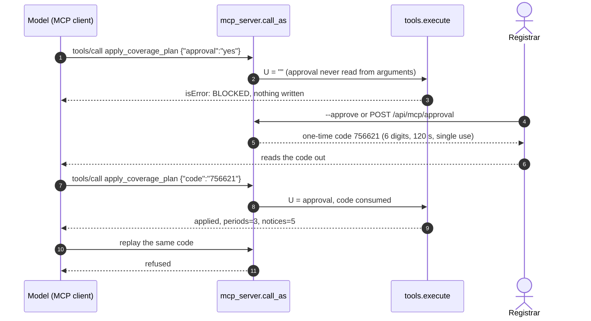
```mermaid
sequenceDiagram
  autonumber
  participant M as Model (MCP client)
  participant C as mcp_server.call_as
  participant X as tools.execute
  actor A as Registrar
  M->>C: tools/call apply_coverage_plan {"approval":"yes"}
  C->>X: U = "" (approval never read from arguments)
  X-->>M: isError: BLOCKED, nothing written
  A->>C: --approve or POST /api/mcp/approval
  C-->>A: one-time code 756621 (6 digits, 120 s, single use)
  A-->>M: reads the code out
  M->>C: tools/call apply_coverage_plan {"code":"756621"}
  C->>X: U = approval, code consumed
  X-->>M: applied, periods=3, notices=5
  M->>C: replay the same code
  C-->>M: refused
```

`tests/mcp_parity.py` replays 13 adversarial items down three paths (the in-app planner,
`call_as`, and a real JSON-RPC `tools/call` round trip) and fails on any divergence. It is
mutation-checked: wiring argument-supplied approval into the MCP path makes item 02 write 3
timetable overrides and trips the parity assertion.

---

## 7. Data model (seeded, realistic)

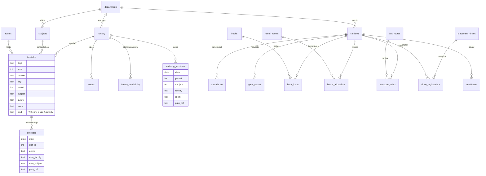
```mermaid
erDiagram
  departments ||--o{ faculty : employs
  departments ||--o{ students : enrols
  departments ||--o{ subjects : offers
  faculty ||--o{ timetable : teaches
  subjects ||--o{ timetable : "scheduled as"
  rooms ||--o{ timetable : hosts
  timetable ||--o{ overrides : "dated change"
  faculty ||--o{ leaves : takes
  faculty ||--o{ faculty_availability : "standing window"
  faculty ||--o{ makeup_sessions : owes
  students ||--o{ attendance : "per subject"
  students ||--o{ gate_passes : requests
  students ||--o{ book_loans : borrows
  books ||--o{ book_loans : "lent as"
  students ||--o{ hostel_allocations : "lives in"
  hostel_rooms ||--o{ hostel_allocations : holds
  students ||--o{ transport_riders : rides
  bus_routes ||--o{ transport_riders : carries
  placement_drives ||--o{ drive_registrations : shortlists
  students ||--o{ drive_registrations : "sits for"
  students ||--o{ certificates : "issued"
  timetable {
    text dept
    int sem
    text section
    text day
    int period
    text subject
    text faculty
    text room
    text kind "T theory, L lab, A activity"
  }
  overrides {
    date date
    int slot_id
    text action
    text new_faculty
    text new_subject
    text plan_ref
  }
  makeup_sessions {
    date date
    int period
    text subject
    text faculty
    text room
    text plan_ref
  }
```

Plus the office ledgers that stand alone: `requests · notifications · audit · exams · placements ·
student_offers · hostel_complaints · bus_stops · credentials · sessions · mcp_approvals`.

Seed: **5 departments, 53 faculty, 1,095 students, 707 timetable slots** across semesters 3/5/7,
plus leave records, an approvals inbox, SEE calendar and placement stats.

<table>
<tr>
<td width="50%"></td>
<td width="50%"></td>
</tr>
</table>

<p align="center">
  
</p>

The attendance chart is shown because it is a **known weak point**, not a strength: every
student's figure is one independent `gauss(80, 12)` draw, so any "attendance risk" analytics built
on it are shallow by construction. Per-subject attendance is derived from it, and adds no signal.

### The timetable generator (`db.py`): how a real college day is modelled

```
P1 09:00–09:55   P2 09:55–10:50   ┃ 20-min break ┃   P3 11:10–12:05   P4 12:05–13:00
┃ 45-min lunch ┃   P5 13:45–14:40   P6 14:40–15:35   P7 15:35–16:30
```

<p align="center">
  
</p>

Hard rules the generator enforces, and `db.verify()` asserts:

1. **No holes.** A class's day is periods 1…N back-to-back. You will never see
   `class / free / free / class`. Breaks are gaps in the *clock*, not empty slots.
2. **Day length by seniority**: sem 3 runs to P7 (39 hrs/wk), sem 5 to P6 (34), sem 7 to P5 (28),
   because final-year batches leave early for project work. Saturdays are short.
3. **Labs are 3 consecutive periods**, inside one session (P1–P3 or P5–P7) so they never straddle
   lunch. Project Phase-I gets two such blocks.
4. **One teacher owns a subject for a class** all semester, allocated up front by expertise and
   load balance, exactly like a department meeting would.
5. **No faculty or room is ever double-booked**, and nobody exceeds their sanctioned load
   (3 hrs of every cap is reserved for activity supervision).
6. **Curriculum gaps become real academic activities** (placement training, mini-project, library,
   mentoring, sports, remedial), never a blank cell. That's ~24% of slots, which matches a real
   VTU timetable.

Because labs are contiguous blocks, the SubstitutionAgent groups consecutive periods of the same
subject into **one teaching block**: an absent lab instructor produces a single `P1–P3` coverage
decision, not three unrelated ones.

### Building a timetable from scratch (`solver.py`)

The seeder above *generates the shipped data*. `solver.py` is the same job as a **feature**: a
constraint solver an admin can run on demand, watch, and approve (Master Timetable →
**Generate from scratch**).

Ported from the Chronos reference solver (`teacher-erp-with-timetable-simulation`, 755 lines of
TypeScript) and adapted to the rules above. Five phases:

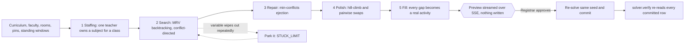
```mermaid
flowchart LR
  IN[Curriculum, faculty, rooms, pins, standing windows] --> ST[1 Staffing: one teacher owns a subject for a class]
  ST --> SE[2 Search: MRV backtracking, conflict-directed]
  SE --> RP[3 Repair: min-conflicts ejection]
  RP --> PO[4 Polish: hill-climb and pairwise swaps]
  PO --> FI[5 Fill: every gap becomes a real activity]
  FI --> PV{{Preview streamed over SSE, nothing written}}
  PV -->|Registrar approves| AP[Re-solve same seed and commit]
  AP --> VF[solver.verify re-reads every committed row]
  SE -. variable wipes out repeatedly .-> PK[Park it: STUCK_LIMIT]
  PK -.-> SE
```

| Phase | What it does |
|---|---|
| Staffing | one teacher owns a subject for a class, by expertise then load |
| Search | backtracking with MRV variable ordering and cost-ranked value ordering |
| Repair | min-conflicts ejection for anything the search could not place |
| Polish | hill-climbing relocation + pairwise exchange, to close gaps and front-load core subjects |
| Fill | every remaining period becomes a real academic activity, so the day stays solid |

<p align="center">
  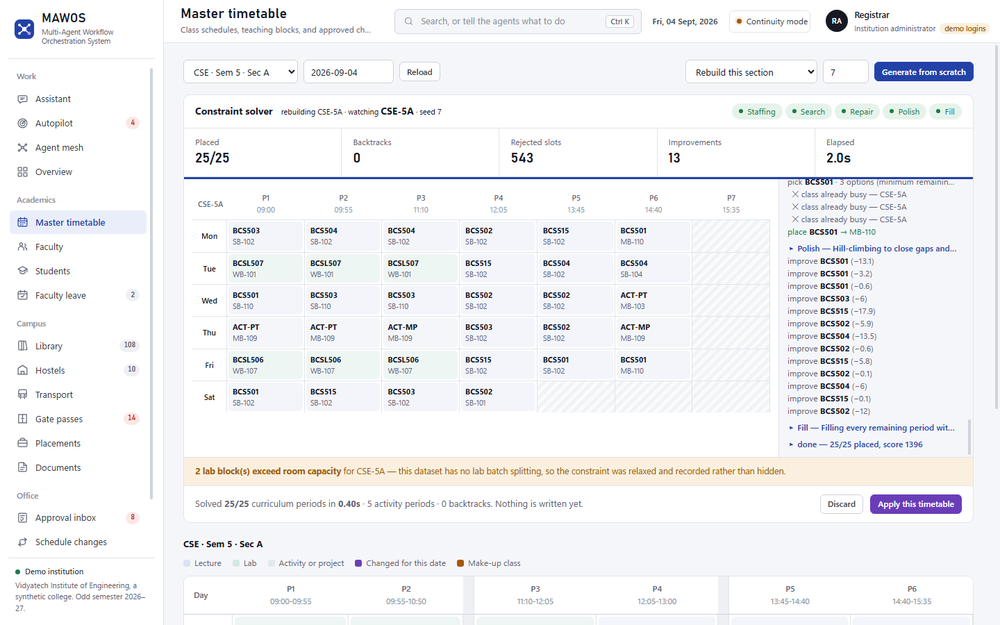
  <br><sub><i>The solver streaming onto a live grid. The right column is the actual decision stream. The amber line names every lab block that exceeds room capacity. Violet means approval: nothing is written until “Apply this timetable”.</i></sub>
</p>

`solve()` is a **generator**. The browser streams every decision over SSE and replays it onto a
live grid, so what you watch *is* the search, not a re-enactment; a caller that just wants a
timetable drains the same generator synchronously. There is one code path, not two.

Three things it adds over the reference, because this college needs them: **multi-period blocks**
(a lab is 3 consecutive periods inside one session), **per-class day length** (sem 3 sits 7
periods, sem 7 sits 5, Saturday is short), and **pinning**. Regenerate one section and every
other section's bookings are frozen and respected, so the rebuild has to fit around teachers who
are already booked elsewhere.

**Nothing is written until you approve.** The stream is a preview; `POST
/api/timetable/generate/apply` re-solves with the same seed (the solver is deterministic on it)
and commits, then runs `solver.verify()` (an independent re-read of the committed rows) before
reporting success. Through the copilot the same work is two tools,
`plan_timetable_generation` then `apply_timetable_generation`, and the second refuses without
explicit admin approval in the current turn, like every other write.

Measured on the seeded institution: **456 curriculum periods across 21 sections in under a
second**, 0 backtracks, 0 clashes, on every one of ten seeds. Under deliberate room scarcity it
degrades instead of collapsing: at one lab room for the whole college it still places 93% and
keeps every day contiguous.

<table>
<tr>
<td width="50%"></td>
<td width="50%"></td>
</tr>
</table>

<p align="center">
  
</p>

Timings are wall-clock on a laptop and vary from run to run (0.3–1.0 s has been seen for the
same solve); the placement counts do not. `docs/charts/results.json` has this run's figures.

**Two limits it reports rather than hides.** Lab rooms seat 36 and a CSE section is ~60, because
real colleges split a lab into batches and this dataset has no batches. The solver relaxes the
capacity constraint and names every affected class in `capacity_relaxed`, shown as an amber
warning above the Apply button. Teachers' **standing availability** (a visiting professor's
off-campus day, a council, a research afternoon) is recorded as weekly windows in
`faculty_availability` (#19). Generation never places a class in one, `solver.verify` reports any
committed class that does, and the substitution planner and make-up booking respect them. The
Registrar records one in plain words ("Prof. X is not available every Friday afternoon"). The
proposal lists the classes already inside the window and offers to rebuild those sections.
Dated leave still drives the *rescheduling* path, not generation.

<details>
<summary>Chart data (table view)</summary>

| Lab rooms available | Placed | Backtracks |
|---|---|---|
| 6 | 456 / 456 | 0 |
| 5 | 456 / 456 | 0 |
| 4 | 452 / 456 | 20 |
| 3 | 446 / 456 | 30 |
| 2 | 436 / 456 | 60 |
| 1 | 425 / 456 | 88 |

Full college, seed 7: 456 / 456 placed, 0 backtracks, 1,269 candidate slots rejected (class 1,204 ·
teacher 54 · room 6 · standing window 4 · daily cap 1), 167 activity periods, 40 lab blocks over
room capacity (reported, not hidden). The college has 15 lab rooms.

</details>

---

## 8. Files

```
VidyaERP/
├── app.py              FastAPI routes, engine switch, static hosting
├── db.py               schema + seeder + CONTIGUOUS timetable generator + verify()
├── solver.py           from-scratch timetable solver (MRV backtracking, streams its trace)
├── nlu.py              intent scoring, priority rules, entity + Indian date parsing
├── agents.py           the academic specialists + PolicyGuard + Auditor
├── campus.py           campus-service agents: library, hostel, transport, gate pass, placement,
│                       documents, leave review, Student 360, Ops radar: tools + rule routing
├── campus_data.py      their tables and seed (own RNG; core institution byte-identical)
├── guard.py            approved_this_turn(): the one write gate, importable by every tool module
├── orchestrator.py     rule-engine supervisor: routing, HITL state machine
├── llm.py              provider-agnostic OpenAI-compatible client (urllib, no SDK)
├── tools.py            the 59 tool schemas + the single dispatch point (gate + role policy)
├── auth.py             sign-in: principals, PBKDF2, hashed sessions, auth.gate() for every route
├── access.py           per-role tool policy: default deny, rules that only ever narrow
├── portal.py           self-service tools for students, faculty and HODs
├── academics.py        standing faculty availability: seed, read and gated write (#19)
├── llm_agent.py        the LLM reasoning loop (plan → call tools → answer), with failover
├── mcp_server.py       MCP surface over stdio JSON-RPC: same tools, same gate, no SDK
├── requirements.txt    FastAPI + Uvicorn. That is the entire dependency list
├── render.yaml         Render Blueprint: one worker, /health, key from the dashboard
├── LICENSE / NOTICE    Apache 2.0, provenance, and the synthetic-data statement
├── .env.example        LLM configuration template (.env itself is gitignored)
├── docs/charts/        make_charts.py (stdlib only) → the README's SVG charts + results.json
├── docs/img/           screenshots of a local instance over the synthetic data
├── static/index.html   the Registrar's console (zero external assets)
├── static/portal.html  the student / faculty / HOD portal, mobile-first
├── static/login.html   sign-in, with the demo accounts listed in demo mode
├── static/blocks.js    block renderers shared by the console and the portal
├── static/mawos.css    the one stylesheet: console, portal, sign-in, mesh overlays (§9a)
├── static/mesh.js      the live 3D agent mesh: canvas projection, playback, fault display
└── tests/
    ├── smoke.py        end-to-end conversation regression
    ├── solver_test.py  timetable solver regression (no server, no API cost)
    ├── mcp_parity.py   the same adversarial items down three paths, identical verdicts
    ├── ranking_test.py plan ranking: every number measured, four labelled defect assertions
    ├── deploy_test.py  deployment claims: key never leaks, /health reads the DB, gate holds
    ├── nlu_test.py     date resolution: all 7x7 weekday pairs pinned, ISO dates read as ISO
    ├── campus_test.py  campus rules pinned case by case, routing kept, core data untouched
    ├── mesh_test.py    the fault channel: failures reported, pinned on their owner, holds are not faults
    ├── auth_test.py    sign-in, every route's gate, per-role policy, self-service writes, session binding
    ├── makeup_test.py  make-ups booked and held, coverage commits verified by an independent re-read
    ├── academics_test.py standing availability: seeded consistently, honoured by solver and planners
    └── mock_llm.py     fake OpenAI endpoint + rogue-agent guard test
```

Console pages: **Assistant** (with the live agent mesh and the execution log), Autopilot,
Agent mesh, Overview, Master timetable (override-aware grid, make-ups and live solver), Faculty,
Students, Faculty leave, Library, Hostels, Transport, Gate passes, Placements, Documents,
Approval inbox, Schedule changes, Audit ledger.

<details>
<summary>How the screenshots and charts were made</summary>

- **Screenshots** (`docs/img/`): a local server on an isolated database with the LLM switched off
  (so the free rule engine answers), driven by headless Edge over the DevTools protocol: sign in
  through the real form, type the request, screenshot. Every name, USN and number in them is
  synthetic. The demo date is Fri 04 Sep 2026.
- **Charts** (`docs/charts/*.svg`): `python docs/charts/make_charts.py --tests`. Standard library
  only, no plotting package, so the two-dependency rule holds. It works on a temporary copy of the
  database, writes each measurement to `results.json`, and draws SVGs that carry their own light
  and dark palettes. The categorical colours (blue / orange / aqua) were checked for colour-blind
  separation; values are also printed on the bars, and the tables above give each chart's data.

</details>

---

### 9a. The interface (`static/mawos.css`)

The product is presented as **MAWOS, the Multi-Agent Workflow Orchestration System**. The
repository and Python modules keep the name VidyaERP, and "Vidyatech Institute of Engineering"
is only the synthetic demo college the data describes. The interface names the system, not the
college.

One stylesheet serves the console, the portal and the sign-in page. It loads nothing from
outside the app, so there are no web fonts: headings use the system's DIN-style face (Bahnschrift
on Windows, DIN Alternate on macOS) and body text uses the system UI face. The palette comes from
a college office, where registers are written in blue ink and approvals are stamped in violet:

| Token | Hex | Used for |
|---|---|---|
| paper / surface | `#F5F6F9` / `#FFFFFF` | page and panels; light mode only, the agent mesh included |
| ink / graphite | `#161922` / `#5E6472` | text |
| register blue | `#2342A8` | primary actions, links, the mark |
| stamp violet | `#6A3DB8` | **only** for approval: a write held by the guard, the approve button on the recommended plan, the "Approved" stamp after a verified commit |
| ok / warn / bad | `#1C7A4B` / `#A35A06` / `#BE3226` | status. Red is a fault the server reported, never decoration |

Rules the markup keeps: sentence case everywhere and no all-caps labels. No emoji in answers or
chrome. Numbers use tabular figures. The page has one animated moment, the request flow on the
sign-in page, and it pauses on "You approve". **Ctrl/⌘ K** opens a command palette that jumps to
any page or sends an instruction straight to the agents.

## 9. Design notes

The NLU + planning layer is deliberately isolated. To go LLM-native:

- Replace `nlu.classify()` with a function-calling LLM; keep `PRIORITY` rules as a cheap
  fallback/validator.
- Expose each specialist method as a **tool schema** (they already return structured dicts).
- Keep `PolicyGuard`, the HITL gate and `Auditor` **outside** the model: the model proposes,
  deterministic code enforces and commits.
- The constraint solver in `SubstitutionAgent` should stay deterministic; LLMs are bad at
  clash-freeness, good at explaining trade-offs.

## 10. Roadmap beyond admin

CIE marks entry and results processing (#32), parent WhatsApp agent (#28), NAAC/NBA evidence-pack
generator (#29), predictive dropout model feeding the RiskAgent (#30), and Kannada/Hindi input for
support staff (#31). Open issues carry the rest, including the known limitations.

---

## 11. Deploying

```bash
# locally, exactly as it ships
python -m uvicorn app:app --port 8000

# on Render: push to GitHub, then Dashboard -> New -> Blueprint -> pick the repo
```

[`render.yaml`](render.yaml) is a complete Blueprint: Python runtime, free plan,
`healthCheckPath: /health`, and the Groq settings as environment variables. **The key is declared
`sync: false`**, so Render prompts for it in the dashboard and it never enters git, which is the
same reason `.env` is gitignored rather than committed. `tests/deploy_test.py` asserts that no
tracked file carries key material, that `/api/mode` reports `key_set` rather than the key, and
that a failed provider call does not echo it back.

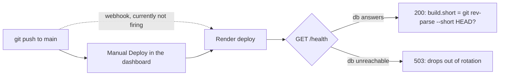
```mermaid
flowchart LR
  GH[git push to main] -. webhook, currently not firing .-> RD[Render deploy]
  GH --> MD[Manual Deploy in the dashboard]
  MD --> RD
  RD --> HC{GET /health}
  HC -->|db answers| OK[200: build.short = git rev-parse --short HEAD?]
  HC -->|db unreachable| BAD[503: drops out of rotation]
```

`GET /health` answers **from the database**, not from the fact that the process is up:

```json
{"status":"ok","service":"vidyaerp",
 "build":{"commit":"9980206...","short":"9980206","branch":"main","source":"platform"},
 "db":{"ok":true,"students":1095,"faculty":53,"timetable":707,"persistent":false},
 "engine":"llm","llm":{"configured":true,"provider":"groq","model":"openai/gpt-oss-120b"},
 "operator_endpoints":"token-protected"}
```

**Check the deployment is current**: one string, no behavioural guessing:

```bash
curl -s https://your-app.onrender.com/health | grep -o '"short":"[^"]*"'
git rev-parse --short HEAD
```

This exists because auto-deploy silently stopped firing. `autoDeploy` was on
and correctly configured, but the webhook never reached Render, so no deploy
was *created*: not a failed build, nothing at all. Two commits sat unshipped
for six days behind a green `/health`, and the only way to notice was spotting
a superseded ranking weight in an API response. `source` says where the commit
came from: `platform` (Render's `RENDER_GIT_COMMIT`), `git` (local `.git`), or
`unavailable`.

The underlying cause, most likely the Render GitHub App's access to the repository, is not
something code can fix, and is unresolved at the time of writing. Until it is, treat every push
as needing a manual deploy (dashboard → **Manual Deploy**) followed by the check above.

An unreachable database returns **503**, so a broken instance drops out of rotation instead of
serving errors behind a green tick. Nothing secret is in that payload: whether a key is
configured, never what it is.

### Three things that are true about a deployed instance

Stated here rather than discovered later. None of them is dangerous; all of them decide how this
may be used.

- **Everyone signs in, but in demo mode every password is published.** Demo mode is the
  default (it keeps `git clone && uvicorn` working): each account's password is its own ID, listed
  on the login page. That makes a public deployment in demo mode a **public demo over synthetic
  data**, never a system of record, and `/health` reports `auth.passwords_published: true` so it
  cannot be missed. For real use set `VIDYAERP_DEMO_LOGINS=0` and `VIDYAERP_ADMIN_PASSWORD`; the
  Registrar then issues temporary passwords from the console (account menu → reset). The two
  operator endpoints take a Registrar session or `VIDYAERP_ADMIN_TOKEN`, which `render.yaml`
  generates.
- **Free instances have an ephemeral filesystem.** `college.db` is rebuilt by `db.seed()` on every
  restart, and free instances spin down when idle, so an applied coverage plan will not be there
  tomorrow. Set `VIDYAERP_DB` to a path on a mounted disk (paid plans) to keep it. `/health`
  reports `persistent: false` when it is not kept.
- **MCP does not reach a remote deployment.** `mcp_server.py` speaks stdio and reads the database
  beside it, so Claude Desktop drives a *local* instance. An approval code minted on the Render
  box is only useful to an MCP client on that box. Driving a deployment over MCP would need an
  HTTP transport, which is not built.

**One worker, deliberately.** `app.py` holds a single module-level SQLite connection and
`orchestrator.SESS` keeps conversation state in process memory, so a second worker would answer
half the turns from a session that never saw the proposal it is being asked to commit.

---

## 12. License

Apache License 2.0; see [LICENSE](LICENSE). You may use, modify and distribute this
commercially, including in closed-source products, provided you keep the copyright and license
notices and state significant changes. It also grants an explicit patent licence, which is why it
is used here in preference to MIT.

[NOTICE](NOTICE) records three things worth reading before you build on this:

- **Provenance.** `solver.py` is a Python port of the constraint solver from
  [Chronos](https://github.com/samprith02/chronos-teacher-erp-timetable), by the same author and
  relicensed here. It is not a transliteration: the port adds multi-period lab blocks,
  per-semester day lengths, scope pinning and conflict-directed backtracking, and fixes a search
  oscillation in the original. `solver.py`'s module docstring records what changed and why.
- **Dependencies.** FastAPI (MIT) and Uvicorn (BSD-3-Clause), neither vendored. No copyleft
  anywhere in the tree.
- **Data.** Entirely synthetic and generated by `db.py`. No third-party dataset is redistributed,
  and no real institution, student or faculty member is represented. The phone numbers are random
  digits for UI layout and must not be dialled.

Portions of this project were developed with AI coding assistants.
